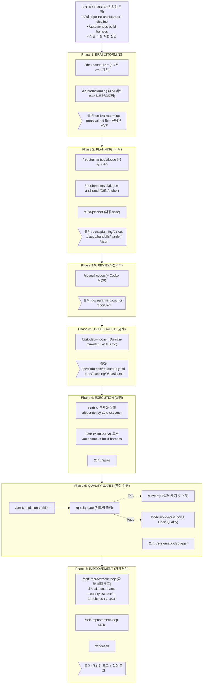
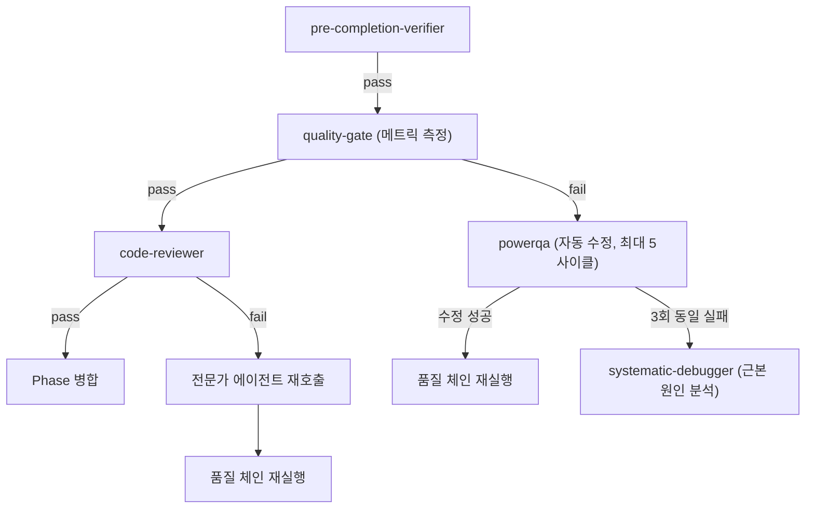
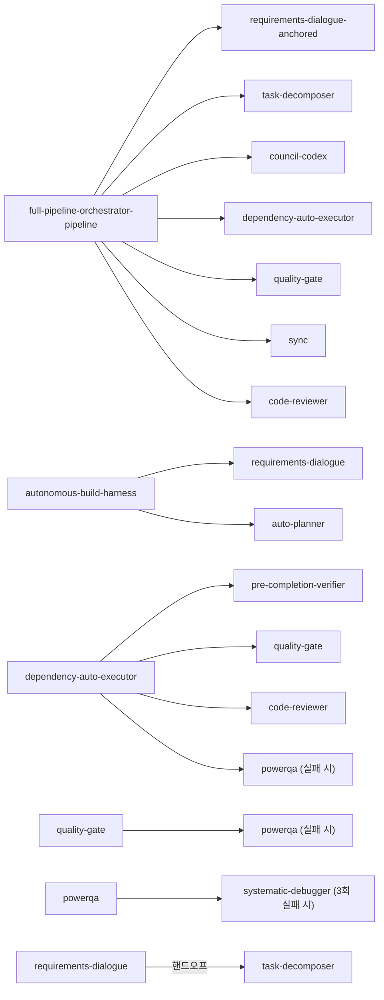
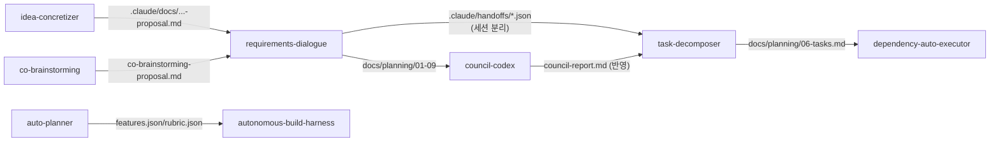
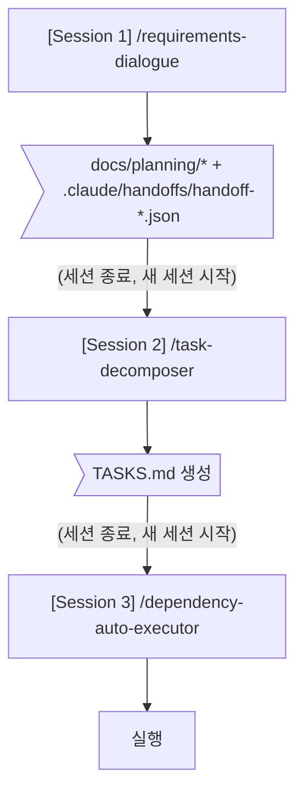

# Skills Relationships & Pipeline Architecture

## 전체 파이프라인 흐름도



---

## 오케스트레이터별 파이프라인 비교

### `/full-pipeline-orchestrator-pipeline` — Drift-Anchored 강화 파이프라인

```
requirements-dialogue-anchored → task-decomposer + council-codex → Execution Topology → dependency-auto-executor → quality-gate + sync + code-reviewer
```

| Phase | 스킬 | 특징 |
|-------|------|------|
| 1 | /requirements-dialogue-anchored | Drift Anchor 생성 (objective/scope/constraint) |
| 2 | /task-decomposer + /council-codex | Static Review Loop (최대 3라운드) |
| 3 | Execution Topology 정의 | 병렬 실행 전략 수립 |
| 3.5 | Gemini MCP 디자인 + 테스트 시나리오 | 디자인/로직 분리 |
| 4 | /dependency-auto-executor | 실행 + branch 격리 |
| 5 | /quality-gate → /sync → /code-reviewer | 3중 품질 검증 |

### `/autonomous-build-harness` — 3-에이전트 Build-Eval 루프

```
requirements-dialogue/auto-planner → spec 변환 → [autonomous-build-harness] x N (사용자 선택: 1/3/5/custom) → final report
```

| Phase | 스킬 | 특징 |
|-------|------|------|
| 0 | 기획 방법 선택 | requirements-dialogue / auto-planner / skip |
| 1 | /requirements-dialogue 또는 /auto-planner | 기획 |
| 2 | Artifact 변환 | features.json, rubric.json, spec.md 생성 |
| 3-4 | /autonomous-build-harness | Build-Eval 피드백 루프 (1/3/5/custom 사이클, 기본 3) |
| 5 | Final report | 종합 리포트 |

---

## 품질 체인 (Quality Chain) — 자동 트리거 순서

각 Phase 완료 시 dependency-auto-executor가 자동으로 실행하는 순서 (sync는 수동 — PR 생성 전/사용자 요청 시):



---

## 스킬 간 의존 관계 맵

### 직접 호출 관계 (A → B = A가 B를 호출)



### 데이터 흐름 (A ──output──→ B)



---

## 선택적/조건부 실행 경로

### Skip Points (건너뛰기 가능 지점)

| 진입 조건 | 건너뛸 수 있는 Phase | 시작 스킬 |
|-----------|---------------------|----------|
| 아이디어만 있음 | 없음 | /idea-concretizer 또는 /co-brainstorming |
| 기획 문서 있음 (docs/planning/) | brainstorming | /task-decomposer |
| TASKS.md 있음 | brainstorming + planning + spec | /dependency-auto-executor |
| spec.md만 있음 | planning | /autonomous-build-harness |

### 세션 분리 (Handoff Protocol)

장시간 기획 작업 시 세션을 분리하여 컨텍스트 초과를 방지:



---

## 병렬 실행 지점

| 스킬 | 병렬 방식 | 대상 |
|------|----------|------|
| /full-pipeline-orchestrator-pipeline Phase 4 | 모델별 분리 | Sonnet(로직) + Gemini(UI) |
| /self-improvement-loop:predict | 5인 페르소나 스웜 | 독립 분석 → 토론 → 합의 |

---

## 독립 스킬 (파이프라인 외부)

파이프라인에 속하지 않고 독립적으로 사용 가능한 스킬:

### 언어/프레임워크 전문가
| 스킬 | 역할 | 자동 트리거 조건 |
|------|------|----------------|
| /python-pro | Python 3.11+ 베스트 프랙티스 | .py 파일 작업 시 |
| /typescript-pro | TypeScript 5.x 타입 안전성 | .ts/.tsx 파일 작업 시 |
| /golang-pro | Go 1.22+ 동시성 패턴 | .go 파일 작업 시 |
| /react-19 | React 19 컴포넌트/hooks | React 컴포넌트 작업 시 |
| /fastapi-latest | FastAPI 비동기 API | FastAPI 코드 작업 시 |
| /kubernetes-specialist | K8s 매니페스트/배포 | k8s YAML 작업 시 |
| /terraform-engineer | IaC HCL 모듈 | .tf 파일 작업 시 |
| /database-optimizer | SQL 쿼리/인덱스 최적화 | DB 스키마/쿼리 작업 시 |

### 유틸리티
| 스킬 | 역할 | 사용 시점 |
|------|------|----------|
| /reasoning | CoT/ToT/ReAct 추론 | 복잡한 문제 분석 시 |
| /memory | 세션 간 지식 축적 | 프로젝트 학습 지속 시 |
| /session-report | 세션 종료 리포트 | 작업 완료 시 |
| /token-compressor | 토큰 절감 (60-90%) | 비용 최적화 시 |
| /cost-model-router | 모델 자동 선택 (40-70% 절감) | 태스크 실행 시 |
| /rag | Context7 최신 문서 검색 | 라이브러리 코드 생성 시 |
| /chrome-browser | 브라우저 자동화 | UI 테스트/디버깅 시 |
| /desktop-bridge | Desktop↔CLI 연결 | 하이브리드 워크플로우 시 |
| /a2a | 에이전트 간 통신 프로토콜 | 멀티 에이전트 협업 시 |
| /kongkong2 | Query Repetition 정확도 향상 | 전 에이전트 자동 적용 |
| /the-fool | 도메인 무관 비판적 추론 | 사각지대 탐색 시 |

---

## 요약: 추천 워크플로우

### 신규 프로젝트 (아이디어 → 배포)
```
/full-pipeline-orchestrator-pipeline  (전체 자동 오케스트레이션)
```

### 기획만 깊이 있게
```
/co-brainstorming → /requirements-dialogue → /council-codex
```

### 기획 완료 후 빠른 빌드
```
/autonomous-build-harness  (auto-planner로 빠른 spec → Build-Eval 루프)
```

### 기존 코드 자율 개선
```
/auto-error-fixer  (에러 수정)
/auto-security-audit  (보안 감사)
/self-improvement-loop:learn  (문서화)
```
